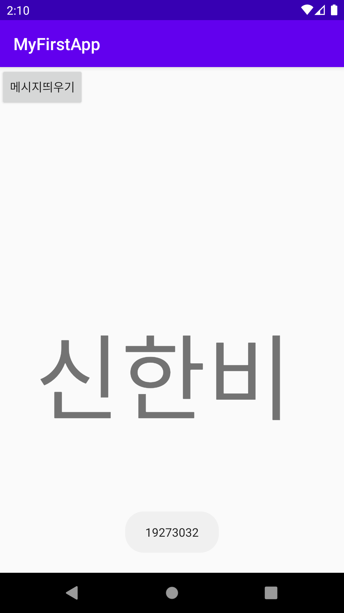
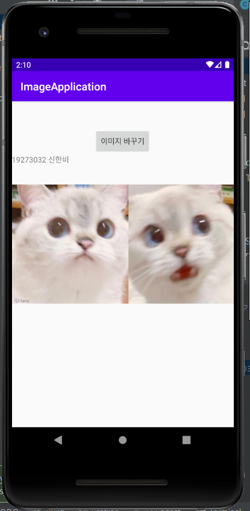
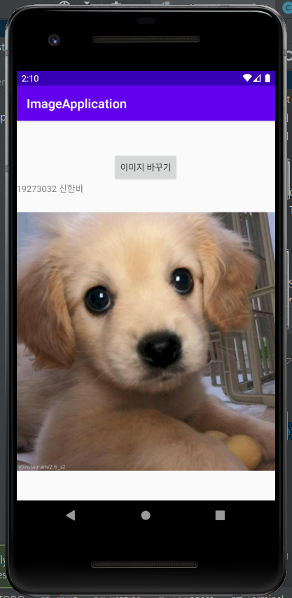
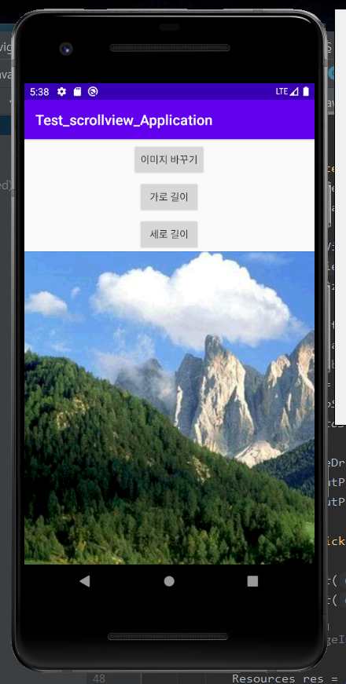
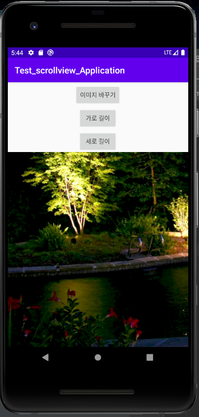
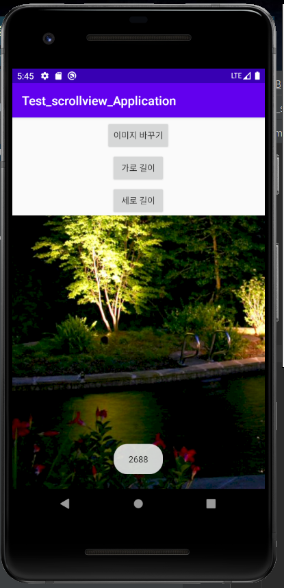
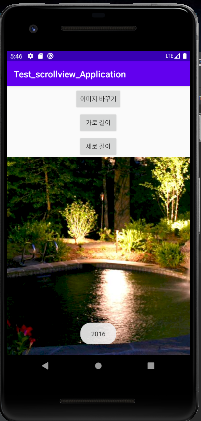

# 19273032 신한비

## 1주차 과제
  

## 2주차 과제

캡스톤 디자인 2주차 과제입니다

  

## 3주차 과제

캡스톤 디자인 3주차 과제입니다
 

## 4주차 과제

  - 아이디어 명 : 지출 관리를 보다 더 쉽고 간편하게 할 수 있는 자산 관리 앱(이하 '순삭페이')
  
  - 기획 배경 : 평소 아르바이트를 하며 돈을 벌어도 '버는 만큼 쓴다'의 신조대로 돈을 과소비하는 경향이 강하다. 그렇기 때문에 항상 용돈 관리 앱과 시급 계산기 같은 애플리케이션을 달고 사는데, 용돈 관리 앱은 인터넷 뱅킹 애플리케이션처럼 통장과 연결되어 있지 않다는 점이 불편하고, 반대로 인터넷 뱅킹 애플리케이션은 말 그대로 인터넷 뱅킹으로서의 역할만 할 뿐 지출 관리에 큰 도움을 주지 않기 때문에, 이 두 가지의 장점만 골라 만든 보다 가벼운 자산 관리 애플리케이션을 만드는 것은 어떨까? 라는 생각을 하고 기획하게 되었다.
  
  - 특징 : 용돈 관리부터 월급 관리까지 다양한 연령층의 수입 관리를 보다 쉽게 할 수 있는 무료 어플리케이션이며, 배너 광고가 있지만 3,000원 이하의 저렴한 금액으로 평생 광고 없이 사용할 수 있게 하여 수익성도 노렸다. 화사하고 귀여운 인터페이스로 본인의 돈 관리를 처음으로 시작하는 사람들이 많은 10대 ~ 20대 초반의 사용자의 접근성이 편하도록 제작되었다. 일정 수입을 매달 자동으로 기록하게 할 수 있고, 필요에 따라 시급 계산기 또한 사용할 수 있다. 월별 소득 및 지출을 분석하여 매달 변동 그래프를 제공한다. 너무 짧은 기간 안에 평소보다 많은 비용을 소비했다거나 얼마나 절약을 잘하느냐에 따라 매주, 매달, 기간별로 ‘통장 날씨’를 확인할 수 있다. 신용카드를 해당 앱과 연계 설정을 하면 카드로 사용한 금액은 결제 시 자동으로 구입처(편의점, 미용실, 병원 등)가 분류되어 기록된다. 해당 기록을 참고하여 정기적으로 영화 관람, 외식같은 여가활동 추천을 해준다.

## 7주차 과제
 
 
 
## 9주차 과제
 
 
 
 
